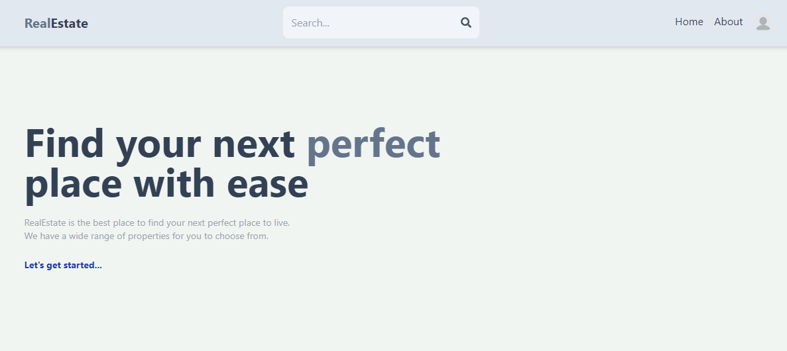
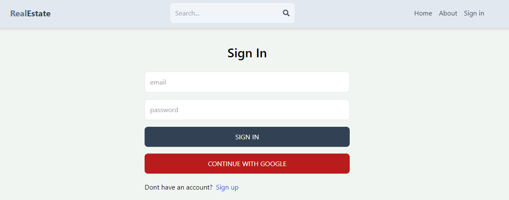
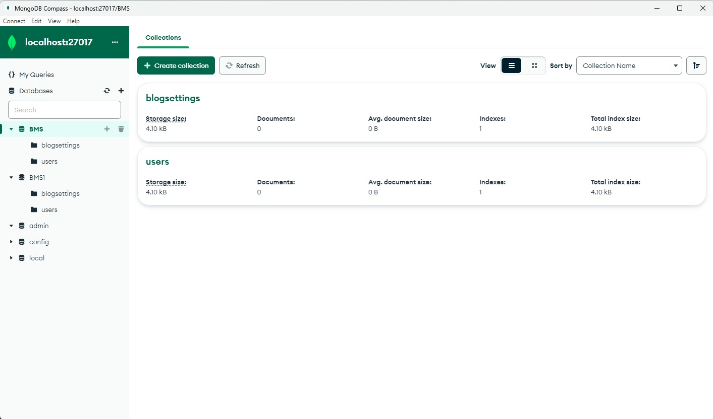

# RealEstate

RealEstate is a Full stack RealEstate rental and selling plattform , it used MERN stack as a Full stack technology, in this web app a user can upload their property to sell and rent some one .

## Installation

Clone the repository

```bash
  git clone https://github.com/msubham193/real-estate
```

```bash
  npm install
```

```bash
  cd client
```

```bash
  npm install
```

## Environment Variables

To run this project, you will need to add the following environment variables to your .env file

`MONGO` - MONGO_DB URL

`JWT_SECRET`

## Screenshots









